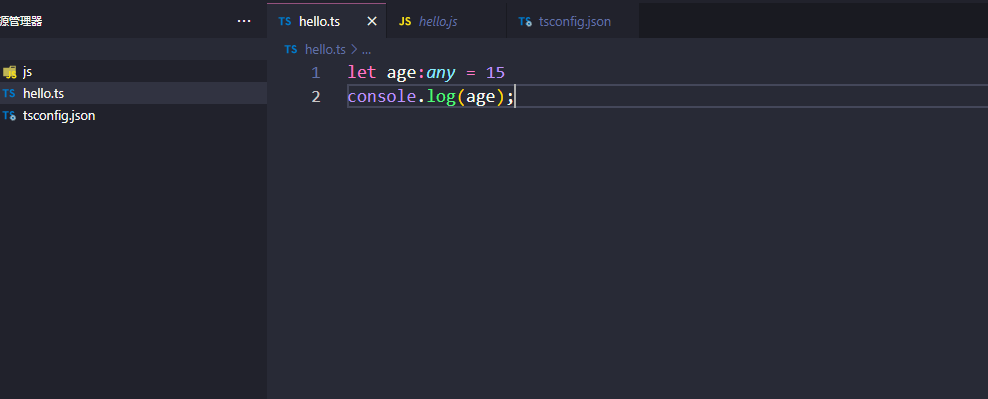
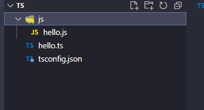
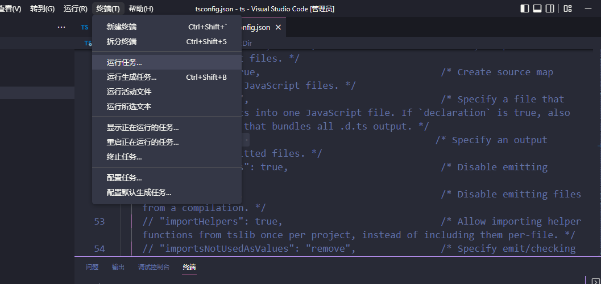
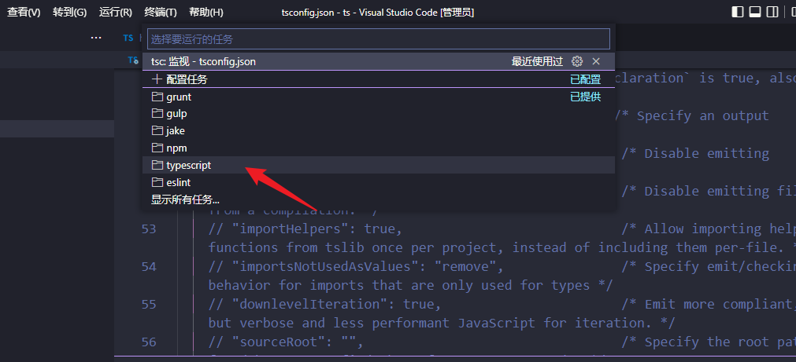
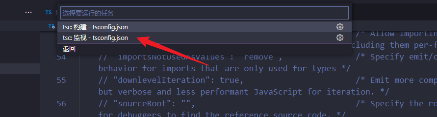
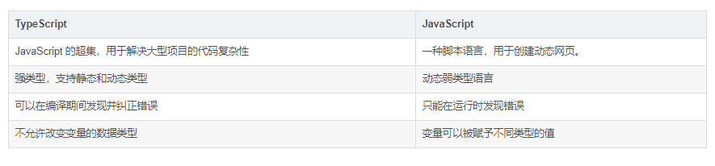

# TypeScript笔记


## 下载

```shell
npm i  -g  typescript
或者
yarn  global add  typescript
```

检测是否安装成功

```shell
tsc -V
```


## 使用

- 新建一个.ts文件
- 书写代码



- 编译ts

```shell
tsc + 文件名
例如：tsc ./hello.ts
```

编译完成会生成js文件



- 运行js文件【node】

```shell
node + 文件名
node ./hello.js
```

## ts修改自动更新js文件

- 初始化

```
tsc -init
```

<font color="gree">**这时候该目录下会有一个 tsconfig.json 文件。在这里面可以做一些关于ts文件的配置**</font>

- 修改tsconfig.json文件 

找到outDir属性，注释打开，路径修改./js

```shell
"outDir": "./js",  
```

- vscode点击终端----> 运行任务----->选择监视typescript

​	





到此就可以监视typescript的变动，自动更新js


## ts和js区别




# TS基础

- 类型

|  类型   |       例子        |              描述              |
| :-----: | :---------------: | :----------------------------: |
| number  |    1，-2，2.5     |            任意数字            |
| string  |   ‘hi',"hi",hi    |           任意字符串           |
| boolean |    true,false     |       布尔值true和false        |
| 字面量  |      其本身       |  限制变量的值就是该字面量的值  |
|   any   |         *         |            任意类型            |
| unknown |         *         |         类型安全的any          |
|  void   | 空值（undefined） |     没有值（或undefined）      |
|  never  |      没有值       |          不能是任何值          |
| object  |  {name:"孙悟空"}  |          任意的js对象          |
|  array  |      [1,2,3]      |           任意js数组           |
|  tuple  |       [4,5]       | 元素，TS新增类型，固定长度数组 |
|  enum   |     enum{A,B}     |        枚举，TS新增类型        |


## 基础类型

### boolean、number 和 string 类型

boolean类型

```typescript
第一种写法
let ishandsome:boolean = true
第二种写法 --- 省略声明类型
let ishandsome = true
如果变量声明和赋值时同时进行的，TS可以自动对变量进行类型监测
```

<font color ="red">当赋值和与定义的不一致，会报错，静态类型语言的优势体现出来了，可以帮助我们提前发现代码中的错误</font>


number类型

```typescript
let age : Number = 18

function sum(a:number,b:number){
    return a+b
}
1.参数类型的指定
2.参数的数量必须要一致

返回值的限制【number类型】
function sum(a:number,b:number):number{
    return a+b
}

```

String类型

```typescript
let realName:String = 'lin'
let fullName:String = `A ${realName}`
```

### 字面量

限制变量的值就是该字面量的值

```typescript
//使用字面量进行类型声明
let a:10
a=10;

// 可以使用 | 来连接多个类型 
let b :'male' | 'female';
b= 'male';
b= 'female';

let c :boolean | string
c = true
c = '11'
```


### undefined 和 null 类型

undefined类型

```typescript
let u:undefined = undefined
```

null类型

```typescript
let n:null = null
```

默认情况下null和undefined是所有类型的子类型，就是说可以把null和undefined赋值给number类型的变量

```typescript
let age: number = null
let realName: string = undefined
```

<font color ="red">但是如果指定了`--strictNullChecks` 标记，null和undefined只能赋值给void类型和它们各自，不然会报错</font>


### any、unknown 和 void 类型

any类型

不清楚用什么类型，可以使用any类型。这些值可能来自于动态的内容，比如：用户输入，第三方代码库

```typescript
let notSure:any = 4
notSure = 'maybe a string'  //可以是string
notSure = false   //可以是boolean

notSure.name   //可以随意调用属性和方法
// notSure.getName()

// 声明变量如果不指定类型,则ts解析器自动判断变量的类型为any(隐式的any)
let d
d= true
d='1111'
d=10
```

不建议使用any类型，不然就丧失了TS的意义


unknown类型

不建议使用any，当我们不知道一个类型具体是什么时，怎么办? ------- 可以使用unKnown类型、

**定义：**

`unknown` 类型代表**任何类型**，它的定义和 `any` 定义很像，但是它是一个**安全类型**，使用 `unknown` 做任何事情都是不合法的。

```typescript
 function divide(param:any){
    return param / 2
 }
 console.log(divide(2));
```

把 param 定义为 any 类型，TS 就能编译通过，没有把潜在的风险暴露出来，万一传的不是 number 类型，不就没有达到预期了吗。


改为unknown  ------TS 编译器就能拦住潜在风险

```typescript
 function divide(param:unknown){
    return param / 2
 }
 console.log(divide(2));
```

但是因为不知道 param 的类型，使用运算符 /，导致报错。


<font color="red">解决方法：类型断言</font>

### 类型断言

- 有些情况下，变量的类型对于我们来说是很明确，但TS编译器却不清楚，可以通过类型断言来告诉编译器的类型

```typescript
//第一种
变量 as 类型

//第二种
<类型>变量 
```

```typescript
 function divide(param:unknown){
    return param as number /2
 }

//第一种
let value:unknown = 'this is a string'
let strvalue:number = (value as string).length

//第二种
let value:unknown = 'this is a string'
let strvalue:number = (<string>value).length
```

### void类型

表示空,以函数为例,就没有返回值的函数

```
function fn():void{
    return
}
```


### never类型

`never`类型表示的是那些永不存在的值的类型。

有些情况下值会永不存在，比如，

- 如果一个函数执行时抛出了异常，那么这个函数永远不存在返回值，因为抛出异常会直接中断程序运行。

- 函数中执行无限循环的代码，使得程序永远无法运行到函数返回值那一步。、

  ```typescript
  //异常  
  function fn3():never{
  throw new Error('报错了')
  }
  
  //死循环，千万别这么写，会内存溢出
  function fn3():never{
      while(true){}
  }
  ```

  never 类型是任何类型的子类型，也可以赋值给任何类型。

  <font color="red">**没有类型是 never 的子类型，没有类型可以赋值给 never 类型（除了 never 本身之外）。即使 `any`也不可以赋值给 never 。**</font>

  ```typescript
  let test1: never;
  test1 = 'lin' // 报错，Type 'string' is not assignable to type 'never'
  
  let test1: never;
  let test2: any;
  test1 = test2 // 报错，Type 'any' is not assignable to type 'never'
  
  ```

### object类型

表示一个js对象

不常用

```typescript
let a:object
a = {};
a = function(){};

```

常用

 {}用来指定对象中可以包含哪些属性

```shell
语法:{属性名:属性值,属性名:属性值}
```

 在属性名后加一个?,表示属性是可选的

```typescript
let b:{name:string,age?:number}
b ={name:'孙悟空',age:18}
```

[propName:string]:any属性，表示任意类型的属性

```typescript
let c:{name:string,[propName:string]:any}
c ={name:'猪八戒',age:18,gender:'男'}
```

**设置函数结构类型声明**

语法：

```shell
(形参:类型,形参:类型...)=>返回值
```

例子

```typescript
let d :(a:number,b:number)=>number;
 d=function(n1:string,n2:string):number{
     return 10
 }
```


### array类型

数组类型的声明

```typescript
类型[]
Array<类型>
```

例子

```typescript
// string[]表示字符串数组
let e :string[]
e = ['a','b','c']


// number[]表示数值数组
let h:number[]
h = [1,2,3]

Array<类型>
let g:Array<number>
g=[1,2,3]
```


### 元组类型（tuple）

元组，就是固定长度的数组

```shell
语法
[类型,类型,类型]
```

例子

```typescript
let vv:[string,string]
vv = ['111','22222']
```

### 枚举类型（enum）

```typescript
enum Gender {
	male = 0,
	female = 1
}

let i: { name: string; gender: Gender };
i = {
	name: '孙悟空',
	gender: Gender.male
};
console.log(i.gender === Gender.male);
```

### 补充

- &符号，表示同时满足

```typescript
let j: { name: string } & { age: number };
j = { name: '孙悟空', age: 18 };
```

- 类型的别名

解决重复要用的东西

```typescript
type mytypes = 1 | 2 | 3 | 4 | 5;
let gg: mytypes;
let hh: mytypes;
let mm: mytypes;

gg = 1;
mm = 3;
```


## 编译选项

- 第一种

```typescript
tsc +文件名 -w

//只能监视当前文件
```

- 第二种 ----- 编译/监视所有文件

  - 首先新建一个tsconfig.json文件

  - tsconfig.json是一个JSON文件，添加配置后，只需tsc或者tsc -w即可对项目进行编译/监视

  - 编译选项：

    - include

      - 用来指定哪些ts文件**需要**被编译

      - 默认值：[“** / *”]

      - 示例

        - ```json
          "include": ["./src/**/*"，"./test/**/*"]
          ```

        - 上述示例中，所有src目录和test目录下的文件全部会被编译

    - exclude

      - 用来指定哪些ts文件**不需要**被编译

      - 默认值：[“node_modules”,"bower_components","jspm_packages"]

      - 示例

        - ```json
          "exclude": ["./src/hello/**/*"]
          ```

        - 上述示例中，src下hello目录下的文件都不会被编译

    - extends

      - 定义被继承的配置文件

      - 示例

        - ```json
          "exclude": "./config/base"
          ```

        - 上述示例中，当前配置文件会自动包含config目录下base.json中所有配置信息

    - files

      - 指定被编译文件的列表，只有需要编译的文件少时才会用到

      - 示例

        - ```json
          "files": ["./src/app.ts", 
                    "./src/hello/hello.ts"，
                     "./src/ee/ee.ts"
                     "./src/rr/rr.ts"
                    "./src/sys/sys.ts"
                    "./src/team/team.ts"
                    "./src/yea/yeas.ts"
                   ]
          ```

        - 列表中的文件都会被Ts编译器所编译

    - compilerOptions【编译器的选项】

      - 编译选项是配置文件非常重要也比较复杂的配置选项

      - 在compilerOptions中包含许多子选项，用来完成对编译的配置

        - 项目选项

          - target

            - *用来指定ts被编译为的ES版本*

            - 可选值：

              - ES3（默认）、ES5、ES6/ES2015、ES7/ES2016、ES2017、ES2018、ES2019、ES2020、ESNext

            - 示例：

              - ```typescript
                "compilerOptions": {
                		// target 用来指定ts被编译为的ES版本
                    	//ES3（默认）、ES5、ES6/ES2015、ES7/ES2016、ES2017、ES2018、ES2019、ES2020、ESNext
                		"target": "ES6"
                	}
                ```

              - 如上设置，我们所有编写的ts代码将会被编译为ES6版本的js代码

          - module

            - *指定要使用的模块化的规范*

            - 可选值：

              - none、commonJs、amd、system、umd、es6、es2015、es2020、es2022、esNext、node12、nodeNext

            - 示例

              - ```json
                "compilerOptions": {
                		// module 指定要使用的模块化的规范
                		// 'none', 'commonjs', 'amd', 'system', 'umd', 'es6', 'es2015', 'es2020', 'es2022', 'esnext', 'node12', 'nodenext'
                		"module": "commonjs"
                	}
                ```

              - 如上设置，我们导入的模块化代码被编译为commonjs的代码

          - lib【一般默认，不用动】

            - 指定代码运行时所办含的库（宿主环境）

            - 可选值：

              - ES5、ES6/ES2015、ES7/ES2016、ES2017、ES2018、ES2019、ES2020、ESNext、DOM、WebWorker、ScriptHost.......

            - 示例

              - ```typescript
                "lib": ["ES2015", "DOM"]
                ```

              - 如上设置，表示ts项目中使用ES2015和dom库

          - outDir

            - 指定编译后文件所在位置

            - 示例

              - 

              - ```json
                "outDir": "./dist"
                ```

              - outFile

                - 将文件合并为一个文件

                - 设置outFile后，所有的全局作用域中的代码会合并到同一个文件中

                  - 如果合并模块化的文件，module属性值必须是【amd、system】

                - 示例

                  - ```json
                    "outFile": "./dist/app.js"
                    ```


  ​              